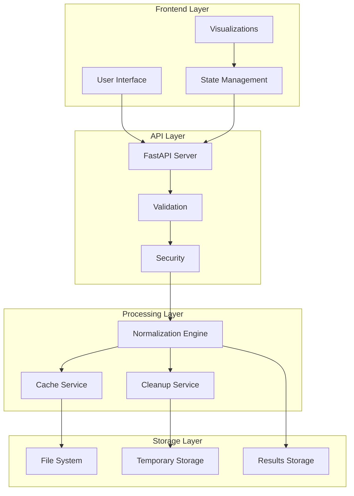
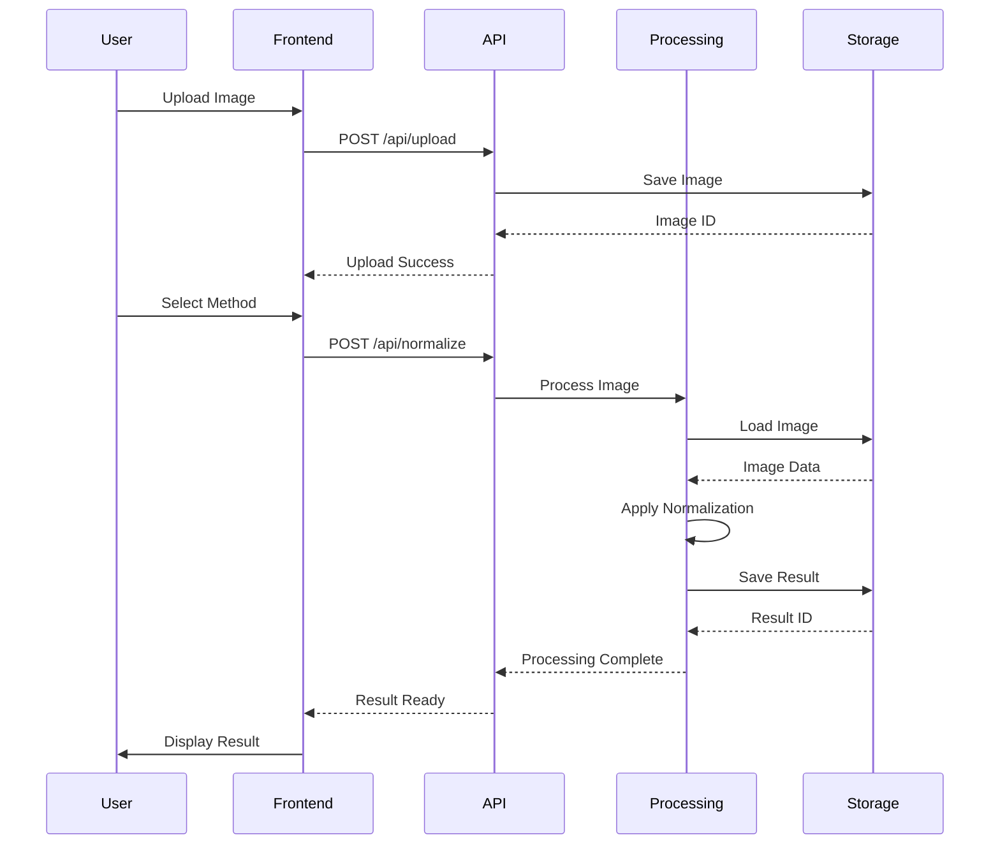

# System Architecture

## Overview

The Color Normalization project follows a modern client-server architecture with a clear separation of concerns. The system is built using FastAPI for the backend and React for the frontend, ensuring high performance and maintainability.

## System Architecture Diagram



## System Components

### Backend Architecture

1. **FastAPI Application**
   - RESTful API endpoints
   - Asynchronous request handling
   - Automatic OpenAPI documentation
   - Request validation using Pydantic

2. **Image Processing Core**
   - Normalization algorithms implementation
   - OpenCV and scikit-image integration
   - NumPy for numerical computations
   - SPAMS for sparse modeling

3. **File Management**
   - Temporary storage system
   - Automatic cleanup service
   - Result caching mechanism

### Frontend Architecture

1. **React Application**
   - Component-based structure
   - State management
   - Responsive design
   - Real-time updates

2. **User Interface**
   - Material-UI components
   - Tailwind CSS styling
   - Interactive visualizations
   - Drag-and-drop uploads

3. **API Integration**
   - Axios for HTTP requests
   - Request/response interceptors
   - Error handling
   - Progress tracking

## System Workflow

The following sequence diagram illustrates the typical workflow of image processing in our system:



1. **Image Upload**
   - File validation
   - Size checking
   - Format verification
   - Temporary storage

2. **Processing**
   - Algorithm selection
   - Parameter configuration
   - Progress monitoring
   - Result generation

3. **Result Delivery**
   - Image download
   - Visualization
   - Comparison tools
   - Statistics display

## API Design

### Endpoints

1. **Upload API**
   ```
   POST /api/upload
   - Multipart form data
   - Returns upload ID
   ```

2. **Normalization API**
   ```
   POST /api/normalize
   - JSON payload with parameters
   - Returns process ID
   ```

3. **Results API**
   ```
   GET /api/results/{id}
   - Returns processed image
   ```

### Response Format

```json
{
  "status": "success",
  "data": {
    "id": "process_123",
    "result_url": "/static/results/123.png",
    "statistics": {
      "time_taken": 2.3,
      "method": "reinhard"
    }
  }
}
```

## Deployment Strategy

### Development Environment
- Local development servers
- Hot reload enabled
- Debug logging
- Development database

### Production Environment
- Nginx reverse proxy
- HTTPS encryption
- Load balancing
- Production database

### Containerization
- Docker containers
- Docker Compose
- Volume management
- Network configuration

## Security Measures

1. **API Security**
   - Rate limiting
   - Input validation
   - CORS configuration
   - Error handling

2. **File Security**
   - Size limits
   - Type checking
   - Virus scanning
   - Automatic deletion

3. **System Security**
   - Environment variables
   - Secure configurations
   - Logging system
   - Backup strategy

## Monitoring and Maintenance

1. **Performance Monitoring**
   - Response times
   - Error rates
   - Resource usage
   - User metrics

2. **System Updates**
   - Regular backups
   - Version control
   - Dependency updates
   - Security patches

3. **Documentation**
   - API documentation
   - Code comments
   - Change logs
   - User guides
